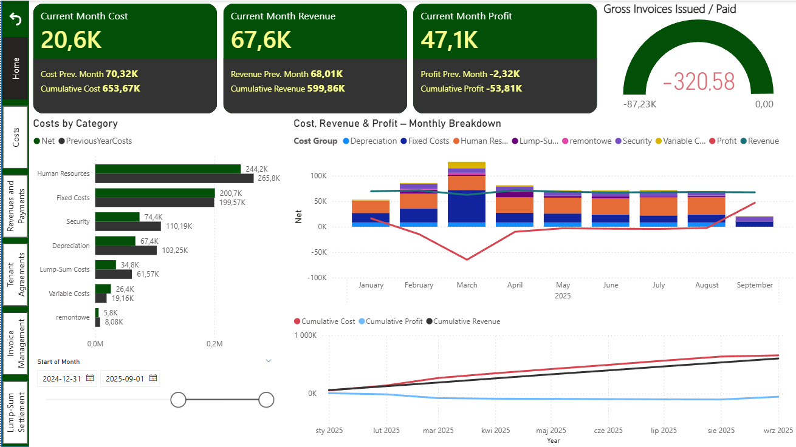
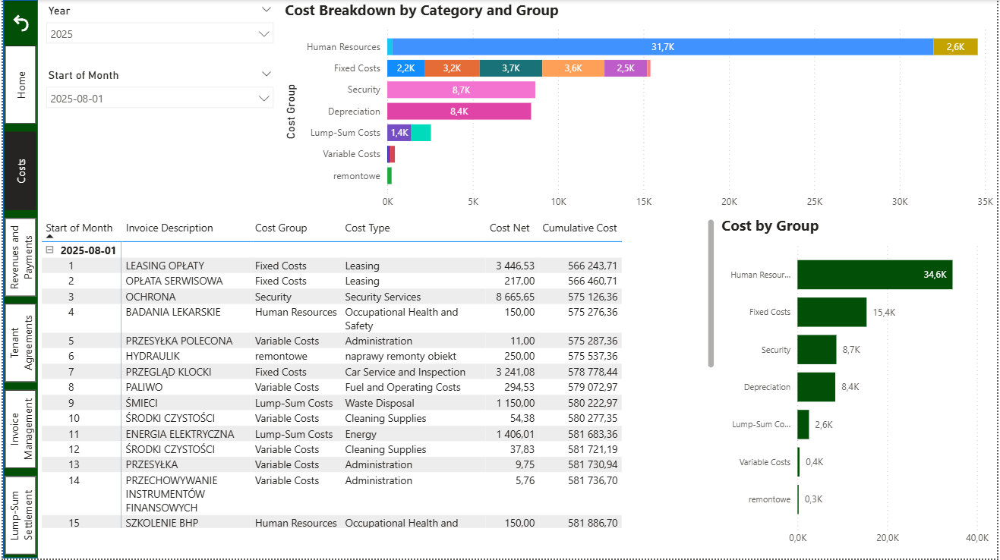
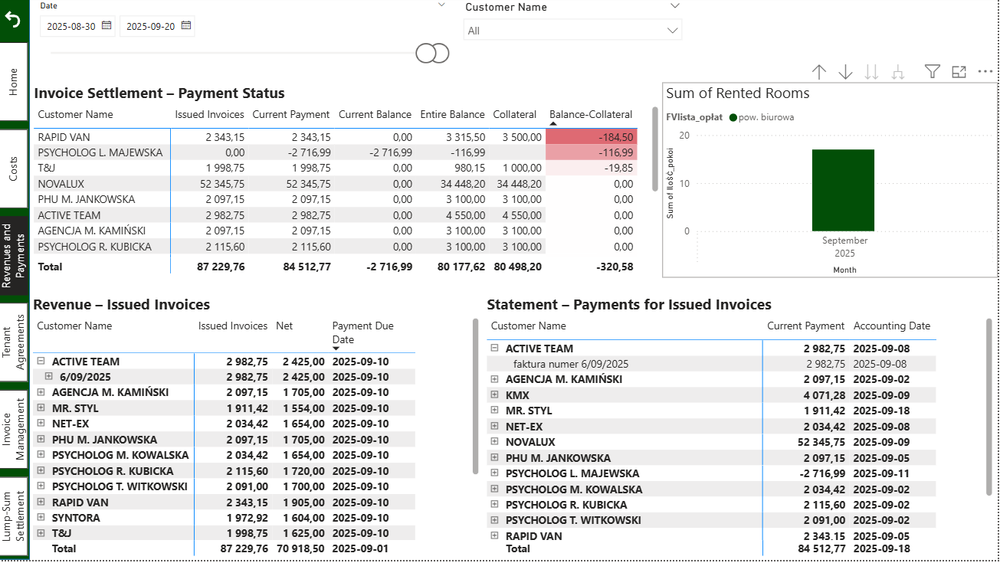
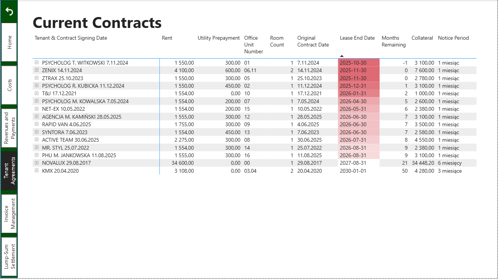
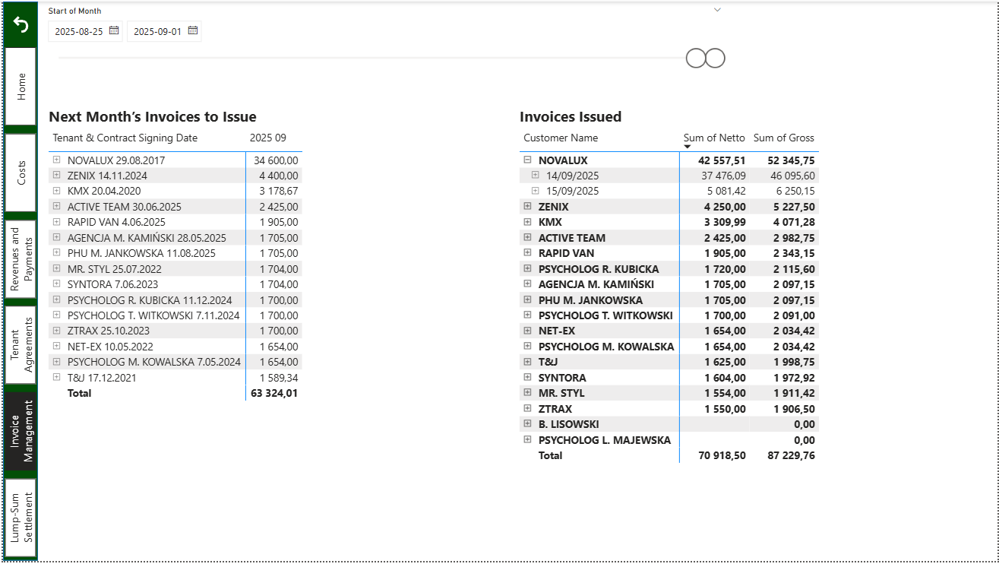
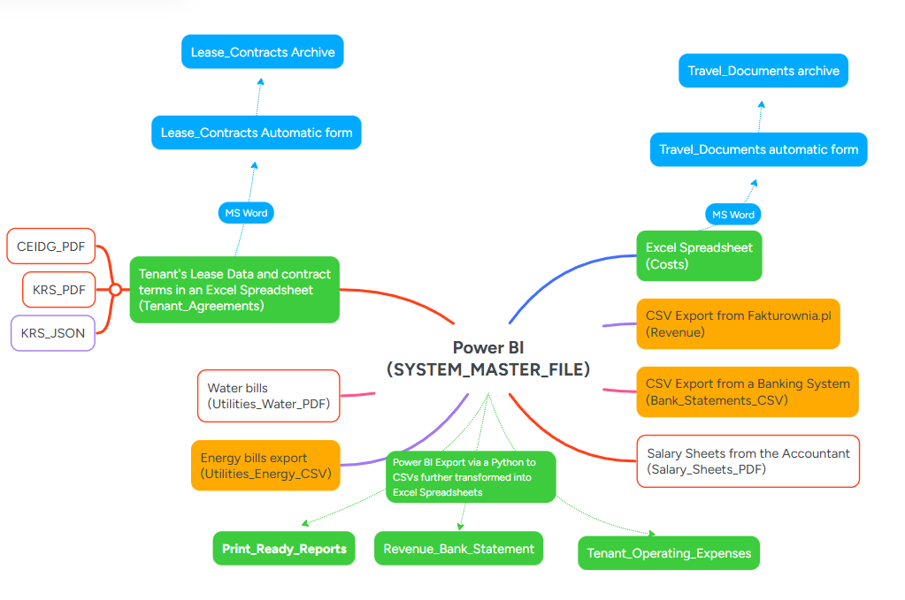
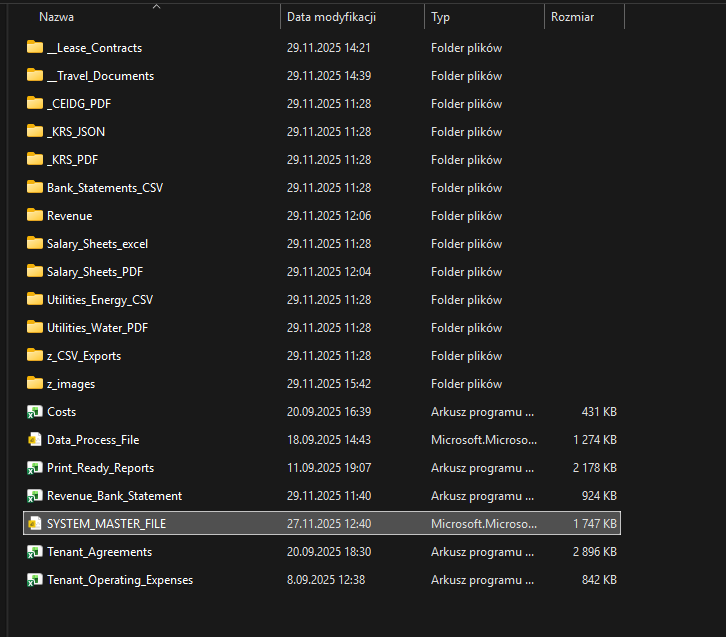
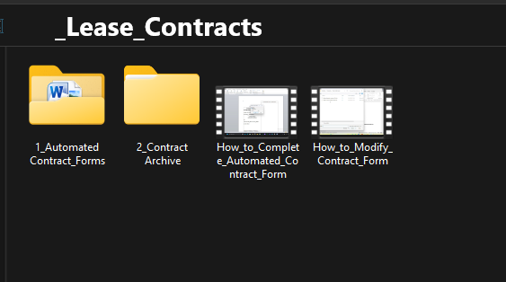
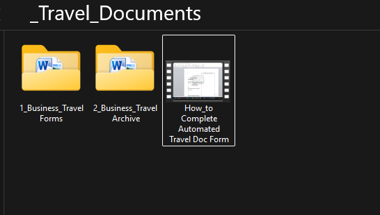

# 📂 Portfolio Project: Business Process Automation with Power BI, Excel, Word, and PDF  
  
## 🎯 Project Goal  
This project demonstrates how data automation and document workflows can streamline everyday business operations  

## 🔑 Key Components  
- **PDF Document Processing**  
  - Automated extraction of payroll data from PDF files.  
  - Integration of parsed data into reporting pipelines.  
- **Cost Aggregation from Excel**  
  - Consolidation and standardization of expense data  
- **Contract Generation (JSON + PDF)**  
  - Automated creation of lease agreements  
- **Dynamic Word Templates**  
  - Mail merge functionality  
- **Power BI Dashboard**  
  - Interactive overview of contracts, rents, deposits  
- **Revenue Tracking (CSV)**  
  - Import of revenue data  
- **Automated Invoice Proposals**  
  - System-generated invoice amounts  

## 🧩 Data Flow Architecture   
The project is illustrated through a mind map, showing:  
- Data sources (PDF, Excel, JSON, CSV, banking exports)  
- Automation processes (parsing, aggregation, document generation)  
- Integration with Power BI (dashboards, alerts, visualizations)  
- End-to-end information flow (contracts → invoices → payments → reporting)  

## 📌 Business Value  
- Time efficiency – reduces manual effort  
- Data consistency – integrates multiple sources  
- Financial transparency – dashboards provide a clear view  
- Process automation – covers the full cycle  
- Scalability – adaptable to other business domains  

## 📝 Summary  
This project showcases how combining Power BI, Excel, Word, and PDF automation creates a complete solution  

## 📸 Dashboard  

1. Home – overview of monthly costs, revenues, payments.  
  
2. Cost – detailed monthly expenses.  
  
3. Revenues and Payments – invoices vs transfers.  
  
4. Tenant Agreements – contract status and rent details.  
  
5. Invoice Management – invoice proposals.  
  
6. Lump-Sum Settlement – utility usage vs lump-sum payments.  

## 📸 Data flow architecture  

  

## 📸 Projets foders structure  

  
  
 