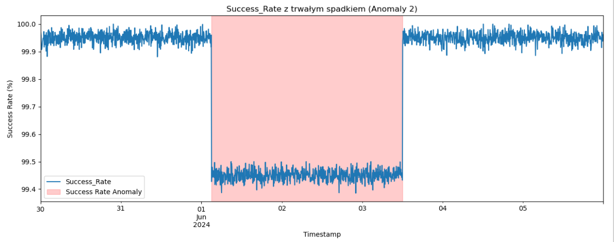
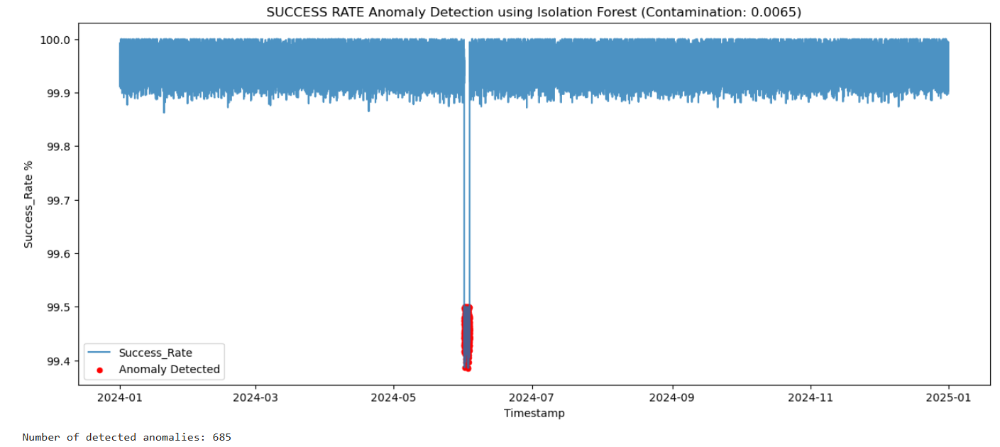
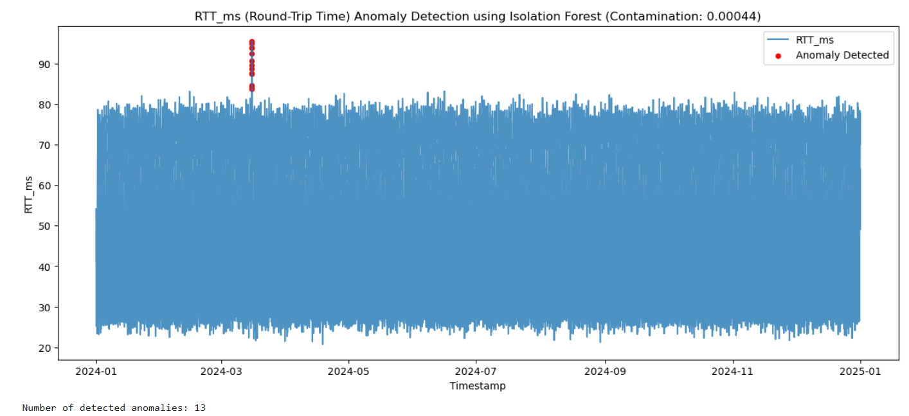

# Energy KPI Anomaly Detection using Isolation Forest

This project demonstrates how to detect anomalies in energy-related KPIs using the Isolation Forest algorithm. It includes synthetic data generation, contamination tuning, and robust validation techniques.

## 🔍 Project Overview

- **Domain**: Energy monitoring and KPI analysis
- **Goal**: Identify anomalies in synthetic time series data using Isolation Forest
- **Tech stack**: Python, scikit-learn, pandas, matplotlib
- **Key features**:
  - Synthetic data fabrication for KPIs like RTT and SR
  - Isolation Forest model with contamination tuning
  - Visual validation and anomaly tagging

## 📁 Repository Structure

energy_KPI_anomaly_detection_IForest/ 
├── README.md  
├── anomaly_detection_IForest.ipynb  
├── data_fabrication_KPI_RTT_SR.ipynb  
├── RTT_SR_with_anomalies.csv

## 📊 Sample Output

The plot below illustrates **Success Rate** fabrication of data and anomally

- **Blue lines** represent success rate values (%).  
- **Red background** highlight anomalies placed.  



The plot below illustrates anomaly detection in the **Success Rate** KPI using the Isolation Forest algorithm with a contamination level of `0.0065`.

- **Blue lines** represent success rate values (%).
- **Red dots** highlight anomalies detected by the model.
- A significant drop in mid-2024 is correctly flagged as anomalous behavior.

**Number of detected anomalies: 685**



The plot below illustrates **Round-Trip Time** fabrication of data and anomally

- **Blue lines** represent Round-Trip Time  (ms) . 
- **Red background** highlight anomalies placed.  


The plot below illustrates anomaly detection in the **Round-Trip Time** KPI using the Isolation Forest algorithm with a contamination level of `0.00044`.

- **Blue lines** represent Round-Trip Time  (ms) .
- **Red dots** highlight anomalies detected by the model.
- A significant drop in mid-2024 is correctly flagged as anomalous behavior.

**Number of detected anomalies: 13**


## 🚀 How to Run

1. Clone the repository:
   ```bash
   git clone https://github.com/Artur-M-47/portfolio.git
   
 2. Navigate to the project folder:
 cd energy_KPI_anomaly_IForest_project
 
 3. Open the notebooks in Jupyter
 
 4. Run data_fabrication_KPI_RTT_SR.ipynb to generate synthetic KPI data.
 
 5. Run anomaly_detection_IForest.ipynb to train and evaluate the Isolation Forest model.
 

