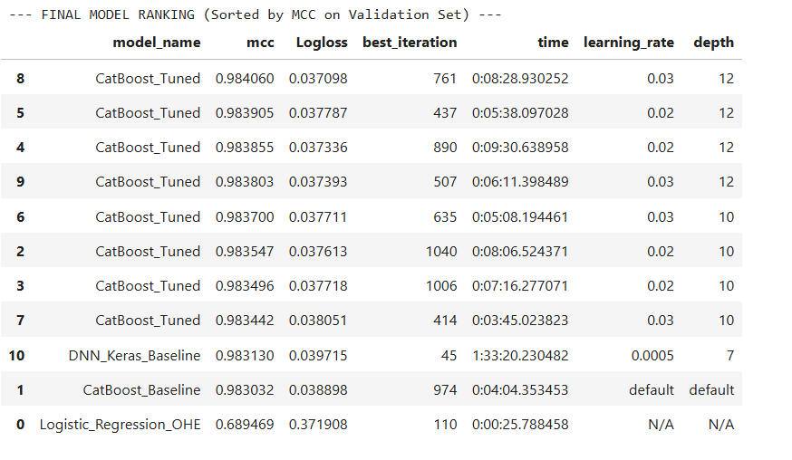

# 🍄 Mushroom Edibility Classification (Kaggle: PS S4E8)
https://www.kaggle.com/competitions/playground-series-s4e

This project focuses on building, tuning, and comparing several Machine Learning models,  
including **Logistic Regression** baseline , a **Tuned CatBoost** classifier, and a **Deep Neural Network (DNN)**,  
to accurately classify mushrooms as either **edible ('e')** or **poisonous ('p')** based on 22 categorical features.

## 📈 Kaggle Performance
The final submission, based on the Tuned CatBoost model, achieved a highly competitive result on the Kaggle Public Leaderboard:

Accuracy Score						0.98481
Ranking (Rank/Total Competitors)	555 / 2422

# 🔍 Project Overview
## 🛠️ Data and Preprocessing
The dataset primarily consists of 22 features (e.g., cap-shape, cap-diameter, cap-surface) and the target variable, edibility.
### Data Cleaning and Reduction
To manage computational overhead and focus the model on the most relevant features, the following steps were taken:
- Dataset Trimming: Training and testing data volume was reduced to under 100 MB to facilitate faster processing and iterative development.
- Feature Removal: Columns exhibiting over **90%** missing values were dropped from the analysis.
- **Categorical Feature Cleaning:**
	- Rare Categories: Infrequently occurring categories were grouped into a single bucket named 'rer_data_category'.
	- Missing Values: Categorical NaN values were explicitly replaced with the category "missing".
- **Feature Selection:** Categorical column selection was validated using the **Chi-Square Test** (no columns were deleted based on this test).
- **Feature Engineering and Scaling**
- **Numerical Normalization:** Numerical features were normalized using Scikit-learn's MinMaxScaler.
- **One-Hot Encoding (OHE):** Due to the highly categorical nature of the data, OHE was extensively applied, expanding the feature space to 107 dimensions. Crucially, the OHE process ensured all splits (train/validation/test) were reindexed to match the final 107-column structure of the training set.

## 📖 Modeling Pipeline
The project consist comparison across different model types:

- Baseline: **Logistic Regression** (Applied to OHE and Scaled data).

- Ensemble Tree: **CatBoost (Baseline & Tuned)**. This model was chosen for its native ability to handle categorical features and its state-of-the-art performance.

- Deep Learning: Deep Neural Network **(DNN)** / Keras (Applied to OHE and Scaled data).



## 📊 Model Comparison: Highest MCC Scores
The final performance comparison table illustrates the effectiveness of different modeling 
approaches on the validation set. CatBoost models, which inherently handle categorical features 
well, achieved the best scores.

# 📁 Binary_Prediction_of_Poisonous_Mushrooms/
├── README.md  
├── Mushroom_Toxicity_Prediction.ipynb (Main EDA, Preprocessing, and Modeling script)  
├── final_submission.csv  
├── DATA_reduced_to_size_under_100_MB/  
│	├── test.csv  
│   └── train.csv  
├── images/  
│   └── model_comparison_table.png  


Feature Importance
The most significant features identified by the top-performing CatBoost model were related to the mushroom's Odor and Gill Size.

## 🧪 Environment Setup

To recreate the environment:

```bash
conda env create -f environment.yml
conda activate mushroom
```
## 🚀 How to Run

1. Clone the repository:
   ```bash
   git clone https://github.com/Artur-M-47/portfolio.git
   ```
2. Navigate to the project folder:  
    ```bash
     cd kaggle_competitions/Binary_Prediction_of_Poisonous_Mushrooms
    ```
3. Open the notebooks in Jupyter
4. Run Mushroom_Toxicity_Predictionmd.ipynb 


