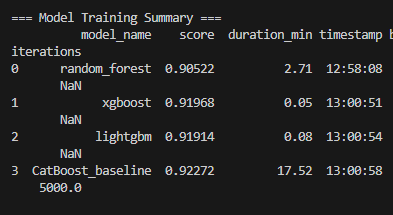
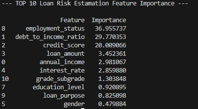
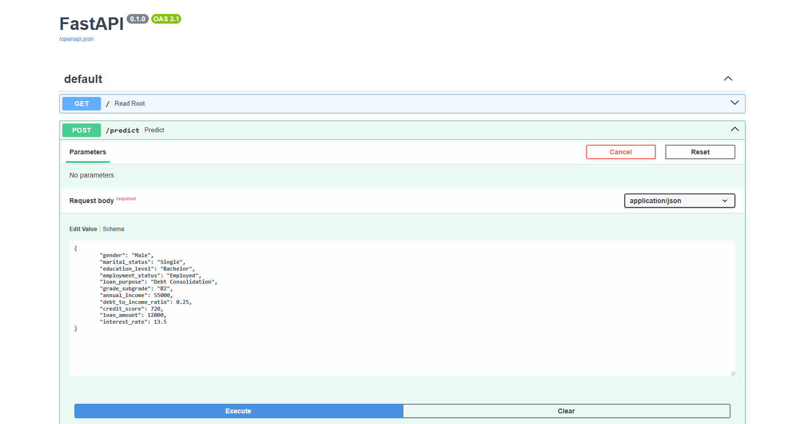
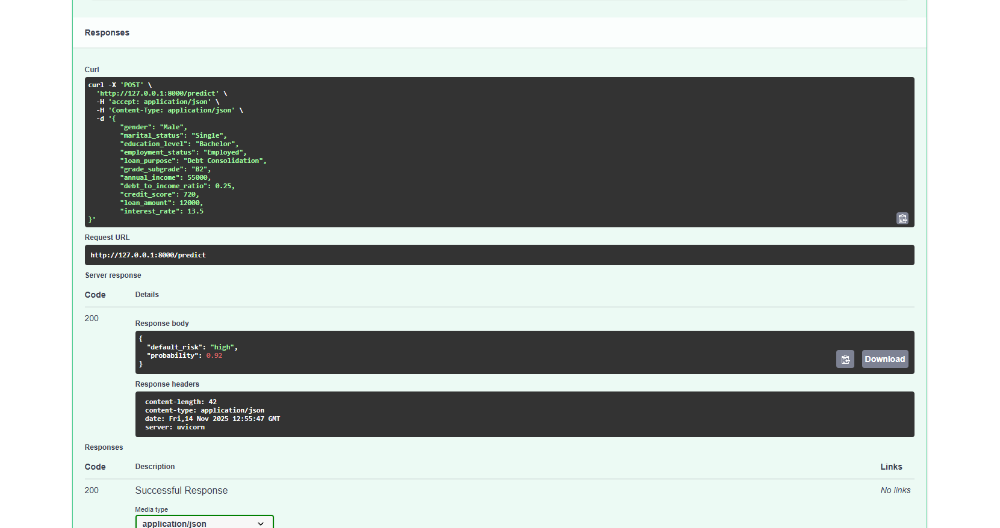
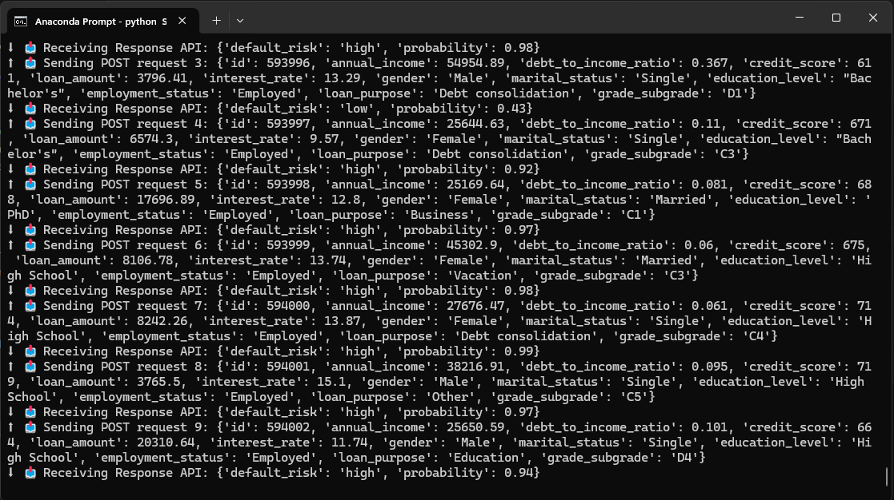

# 💰 Loan Default Risk API  
# FastAPI | CatBoost | Simulated API Testing | AI-Ready
## 🚀 Introduction
This project showcases a production-grade FastAPI application designed to predict loan default risk using a trained CatBoost model. It is architected for scalability, modularity, and future integration with modern AI frameworks (e.g., LangChain, RAG, Vector DB).The application exposes a simple /predict endpoint that accepts loan application data and returns the probability of repayment (or default risk) along with a simple risk classification.Project Goal: Predict the probability that a borrower will pay back their loan.Evaluation Metric: Area Under the ROC Curve (ROC AUC).

Achieved Accuracy (ROC AUC): 0.923

🧠 Data Science Workflow & Modeling
The model selection process was comprehensive, focusing on achieving superior predictive power and stability:

1. Experimental Phase & Benchmarking
The project began with extensive Jupyter Notebook experiments (notebooks/). This phase covered:

Exploratory Data Analysis (EDA): Deep dive into feature distributions and correlations.

Feature Engineering: Creation of new, highly predictive features.

Model Benchmarking: Comparison of four robust classification algorithms:  
  ⏹️ Random Forest  
  ⏹️ XGBoost  
  ⏹️ LightGBM  
  ⏹️ CatBoost  

2. Model Selection and Advanced Tuning
Selection: CatBoost was chosen due to its superior baseline performance and native handling of categorical features, which simplifies the production pipeline.

Hyperparameter Optimization: The selected CatBoost model underwent a dedicated tuning process to find optimal parameters.

Quality Assessment (K-Fold Cross-Validation): The final model's stability and generalization capability were rigorously verified using **K-Fold Cross-Validation** (Experiment 2 of 3 was selected as the final approach). This robust evaluation ensures the reported ROC AUC of 0.923 is reliable.  

  
  

3. Production Deployment
The optimized CatBoost model was serialized and integrated into the FastAPI service, ready for real-time predictions.


## 🏗️ Architecture and Tech Stack

The project employs a modular structure to facilitate testing, maintenance, and future expansion.  
| Layer            | Tools Used         | Description                                                                 |
| ---------------- | ------------------ | --------------------------------------------------------------------------- |
| API Framework    | FastAPI            | A fast, asynchronous framework for serving the API.                         |
| Model Serving    | CatBoostClassifier | Gradient Boosting algorithm with native support for categorical features.   |
| Data Validation  | Pydantic           | Defines schemas for structured JSON input and output.                       |
| Data Transformation | pandas, pickle  | Data preprocessing and serialization of model artifacts.                    |
| Environment      | Python 3.10, conda | Management of dependencies and the virtual environment.                     |
| Deployment Ready | Modular Python, Docker-friendly | Designed for easy CI/CD and containerization.          |
| Future Extensions| LangChain, LangGraph, FAISS | Ready for extension into agentic architecture and vector search pipelines. |


## 📂 Project Structure
```text
kaggle_competitions/Predicting_Loan_Payback/
├── app/  
│   ├── __init__.py
│   ├── model.pkl
│   ├── list_cat_columns.pkl
│   ├── list_num_columns.pkl
│   ├── train_columns.pkl
│   ├── schemas.py
│   ├── transform.py
│   └── predict.py
│
├── data/
│   ├── train.csv
│   └── test.csv
│
├── images/
│   ├── FastAPI_Enter_Data.PNG
│   ├── FastAPI_Response.PNG
│   ├── Feature Importance.PNG
│   ├── model_scores.PNG
│   └── Tests.PNG
│
├── notebooks/              
│   ├── 1_experiments/
│   │   ├── Experimental_Predicting_Loan_Payback.ipynb
│   │   └── exp_train_columns.pkl
│   ├── 2_experiments/
│   │   ├── Experimental_Predicting_Loan_Payback.ipynb
│   │   └── exp_train_columns.pkl
│   └── 3_experiments/
│       ├── Experimental_Predicting_Loan_Payback.ipynb
│       └── exp_train_columns.pkl
│
├── train_model.py
├── main.py
├── loan_env.yml
├── README.md
└── tests/
    └── Simulated_Api_from_test.py   # Script for simulating API POST requests
```
## 🧪 Environment Setup
To recreate the environment:

```bash
conda env create -f loan_env.yml
conda activate loan_env
```

## 🚀 How to Run
The following instructions assume you are using Anaconda/Miniconda.

1. Clone the repository:

```bash
git clone [https://github.com/Artur-M-47/portfolio/tree/main/kaggle_competitions/Predicting_Loan_Payback]
```
2. Model Training (Optional)
If you need to retrain the model or benchmark the algorithms:

```bash 
# Run the training script.
# This will generate: model.pkl, list_cat_columns.pkl, and list_num_columns.pkl
python train_model.py
```
3. Running the API Server
Navigate to the project's root directory and start the FastAPI server. The 
```bash
--reload
``` 
flag enables automatic server restart upon code changes.
```bash
# Start the Uvicorn server
uvicorn main:app --reload
``` 
The server will be available at: http://127.0.0.1:8000/  
Health Check Verification:Visit http://127.0.0.1:8000/. You should see:  
```json
{
"message":"Loan Default Risk API is running."
}
```  

Interactive Documentation:Navigate to **http://127.0.0.1:8000/docs#/** to access the Swagger UI and interactively test the endpoints.

🧪 The /predict Endpoint

This endpoint takes loan application features and returns a default risk prediction.
POST /predict

### Example Request Body (JSON)

```json
{
  "gender": "Male",
  "marital_status": "Single",
  "education_level": "Bachelor",
  "employment_status": "Employed",
  "loan_purpose": "Debt Consolidation",
  "grade_subgrade": "B2",
  "annual_income": 55000,
  "debt_to_income_ratio": 0.25,
  "credit_score": 720,
  "loan_amount": 12000,
  "interest_rate": 13.5
}
```

### Example Response (JSON)

```json
{
  "default_risk": "low",
  "probability": 0.92
}
```

⏹️ probability: The predicted probability that the loan will be paid back (loan_paid_back=1).  
⏹️ default_risk: A simple risk classification (e.g., "low" or "high") based on a predetermined probability threshold.

## 📊 Simulated API Testing
To validate the API's behavior with multiple records (e.g., from a test.csv file), use the provided test client:
1. Ensure the API is Running (see Step 3 above).
2. Run the test client in a separate terminal:

```bash
# Ensure the test.csv file exists in ../data/
python Simulated_Api_from_test.py
```
This script will read test data, convert it to JSON, send each record as a POST request to the server, and print the API's response to the console.

